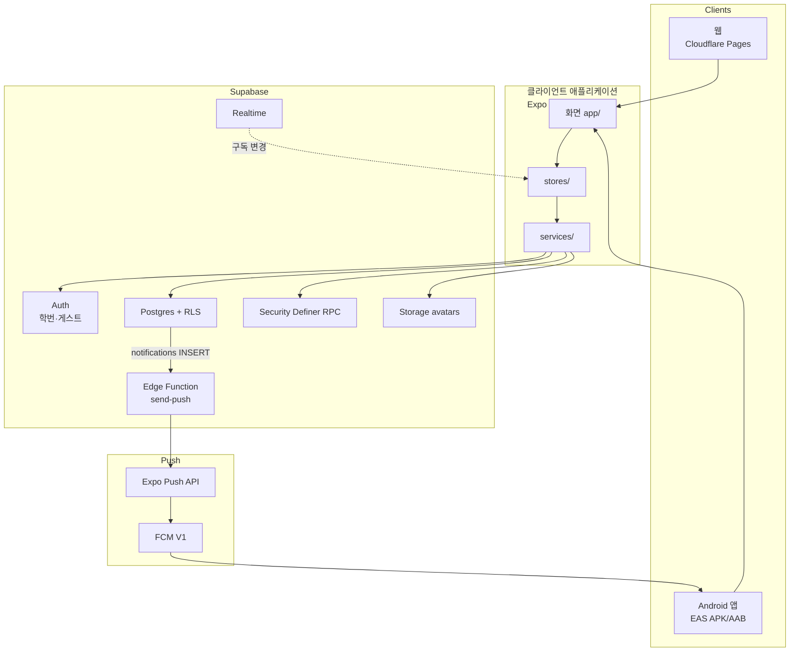
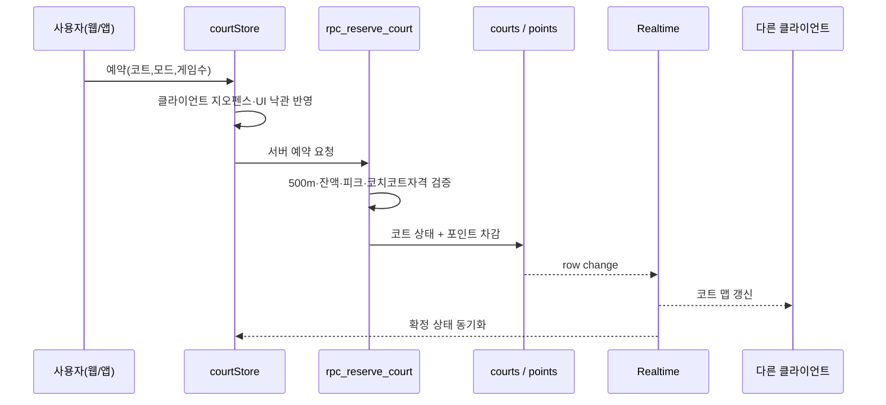
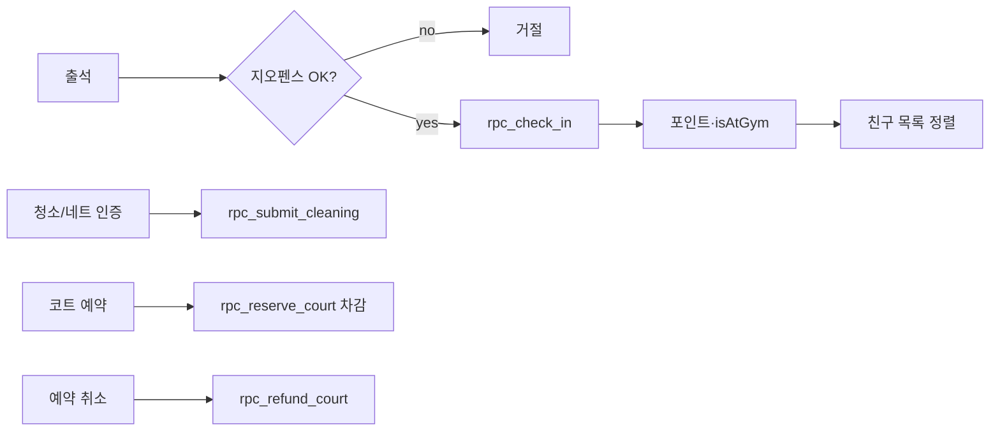
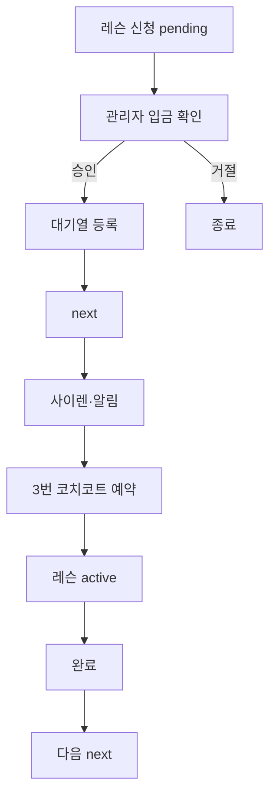
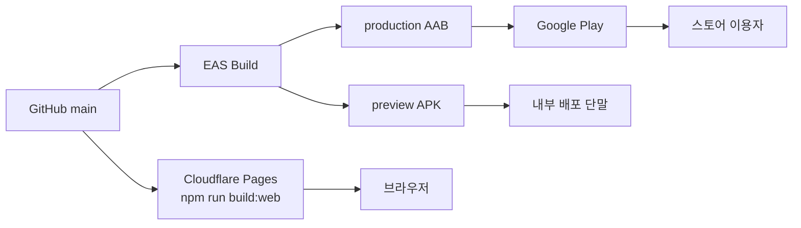
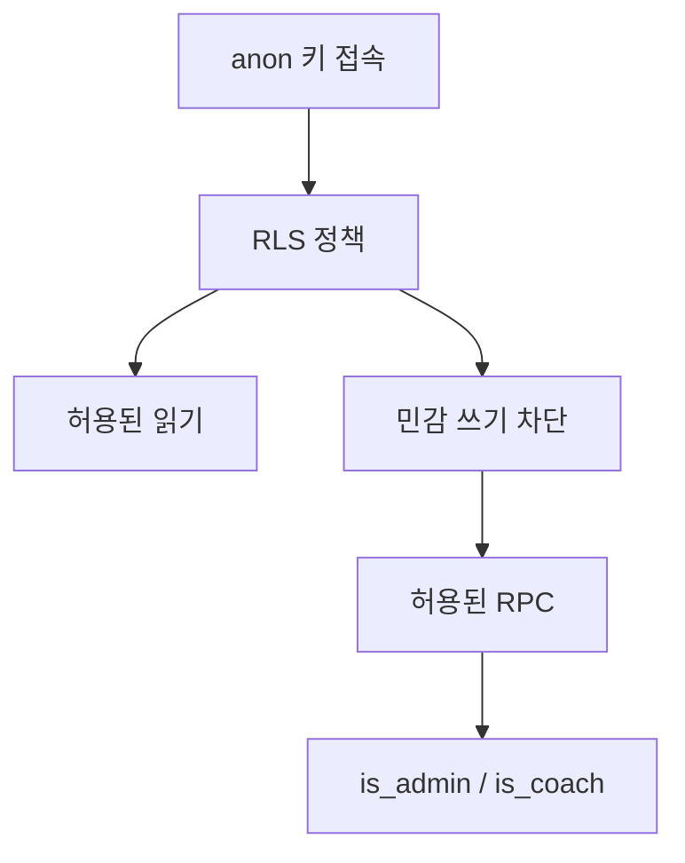

# Drop 시스템 아키텍처

**문서 버전**: 2026-07-08  
**대상**: Drop 웹 클라이언트, Android 클라이언트, Supabase 백엔드의 구성 및 데이터 흐름

관련 문서: [PRODUCT_SPEC.md](./PRODUCT_SPEC.md) · [PRIVACY_POLICY.md](./PRIVACY_POLICY.md) · [PUSH_AND_PLAY_STORE.md](./PUSH_AND_PLAY_STORE.md)

---

## 1. 시스템 구성



### 설계 원칙

- 포인트 적립, 코트 예약, 출석 등 민감 쓰기는 클라이언트에서 테이블을 직접 수정하지 않으며, 서버 RPC가 지오펜스·비용·권한을 검증한다.
- 다수 클라이언트가 동일 리소스를 조회할 때 Supabase Realtime으로 코트·프로필·알림 상태가 동기화된다.
- `EXPO_PUBLIC_SUPABASE_*`가 설정된 환경에서는 Supabase를 사용한다. 미설정 시 로컬 AsyncStorage 및 선택적 동기화 서버로 동작한다. 프로덕션 배포는 Supabase를 사용한다.

---

## 2. 부팅 및 인증

```mermaid
flowchart TD
  Start[앱 실행 _layout] --> Env{Supabase<br/>URL+anon?}
  Env -->|yes| InitSB[initSupabaseApp<br/>세션·프로필·Realtime 구독]
  Env -->|no| InitLocal[hydrate + 선택 sync 서버]
  InitSB --> Push{네이티브 and<br/>비게스트?}
  Push -->|yes| RegToken[registerPushTokenForUser]
  Push -->|no| Ready[화면 가드]
  RegToken --> Ready
  InitLocal --> Ready
  Ready --> Guard{useAuthGuard<br/>세션?}
  Guard -->|없음| Login[/login]
  Guard -->|있음| Tabs[탭 화면]
```

### 인증 방식

| 방식 | 동작 | 비고 |
|------|------|------|
| 학번 회원 | 가상 이메일 `drop-{학번}@example.com` + 비밀번호 | 마이그레이션 `013` 적용 후 신규 가입은 준회원·승인 상태로 생성 |
| 게스트 | Anonymous Auth + `rpc_setup_guest_profile` | 코트 예약·이용 안내. 포인트·친구·랭크 제한 |
| 관리자 | `membership_tier = admin` | `/admin` 및 운영 RPC |

공개 경로: `/login`, `/privacy`

---

## 3. 코트 예약 · 합류



**합류**: 신청 → 코트 `join_requests` → 호스트 수락 → 인원 반영 → (해당 시) `notifications` insert → 원격 푸시.

**경기 점수**: 점수 입력 시 Elo·전적·포인트 반영. 일일 자동 반영 한도 초과 시 관리자 승인. 난타(`nanta`)는 Elo 미반영.

---

## 4. 출석 · 포인트



적립 금액은 서버가 결정한다. 클라이언트는 `profiles.points`를 직접 상향할 수 없다 (`guard_profile_columns`, `006_secure_points`).

---

## 5. 레슨 · 코치 코트



코치 공지 작성 권한: `is_coach` 또는 `admin` (`012_coach_access`).

---

## 6. 알림 · 원격 푸시


| 구분 | 범위 |
|------|------|
| 인앱 알림 | 알림함·토스트·사이렌. 웹·앱 공통 (`notificationStore`) |
| 원격 푸시 | 네이티브 앱에서 알림을 허용한 경우. OS 푸시는 웹 단독 환경에서 제공되지 않음 |

---

## 7. 배포



| 환경 변수 | 용도 |
|-----------|------|
| `EXPO_PUBLIC_SUPABASE_URL` | Supabase 프로젝트 URL |
| `EXPO_PUBLIC_SUPABASE_ANON_KEY` | 공개 anon 키 (RLS 적용) |
| `service_role` | SQL 트리거·Edge Function 전용. 클라이언트 및 공개 저장소에 포함하지 않음 |

---

## 8. 데이터 · 권한



스키마 적용 순서: `001` / `complete_after_enums` → `002` Storage → `005`–`015`.  
상세: [SUPABASE_MIGRATION.md](./SUPABASE_MIGRATION.md).

---

## 9. 화면 ↔ 백엔드

| 경로 | Store | 백엔드 |
|------|--------|--------|
| `/` | `courtStore` | `rpc_reserve_court`, courts Realtime |
| `/friends` | `friendStore`, profiles | `friend_requests`, attendance |
| `/lobby` | `lobbyStore` | `team_rooms` |
| `/profile` | `authStore`, `pointStore` | check-in, points, matches |
| `/coaching` | `lessonStore`, `coachingStore` | `lesson_queue`, `coach_announcements` |
| `/admin` | admin* | 운영 RPC·로그·리셋 |
| `/privacy` | — | 개인정보처리방침 |
