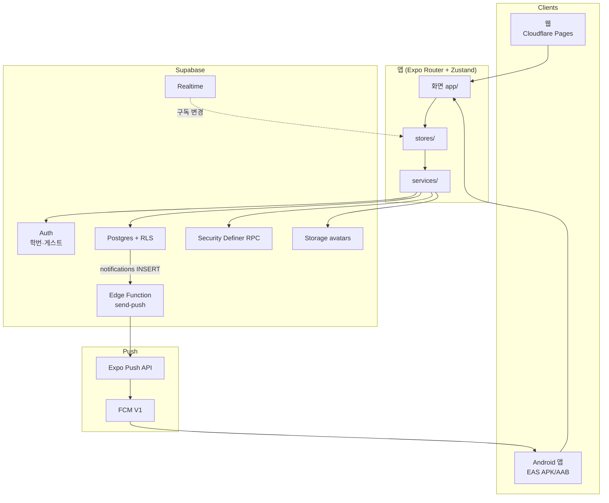
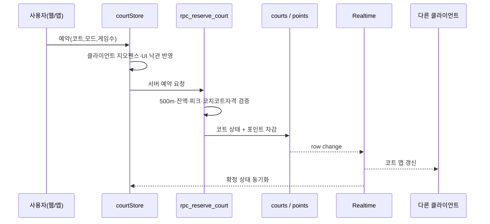
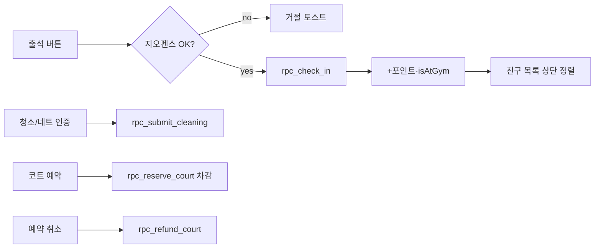
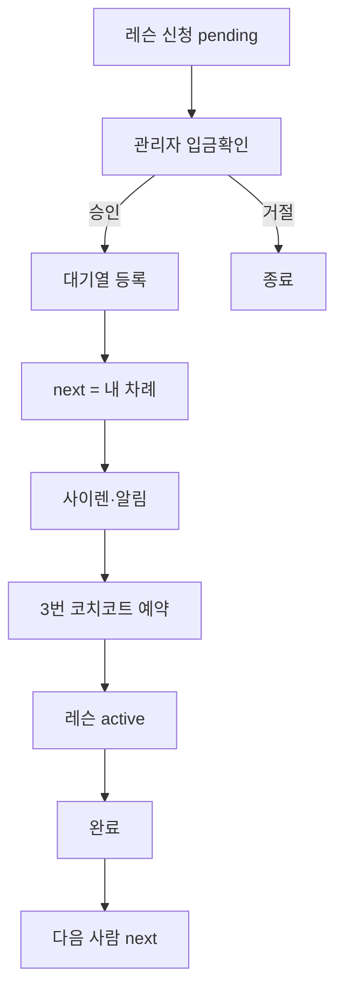
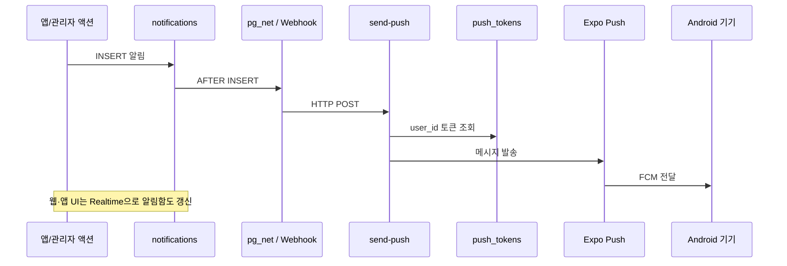
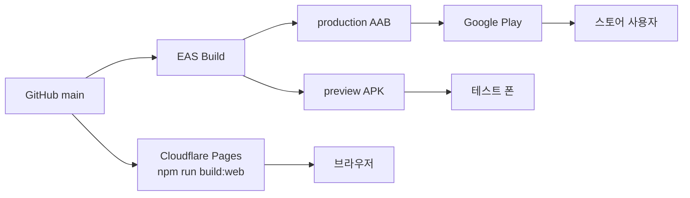
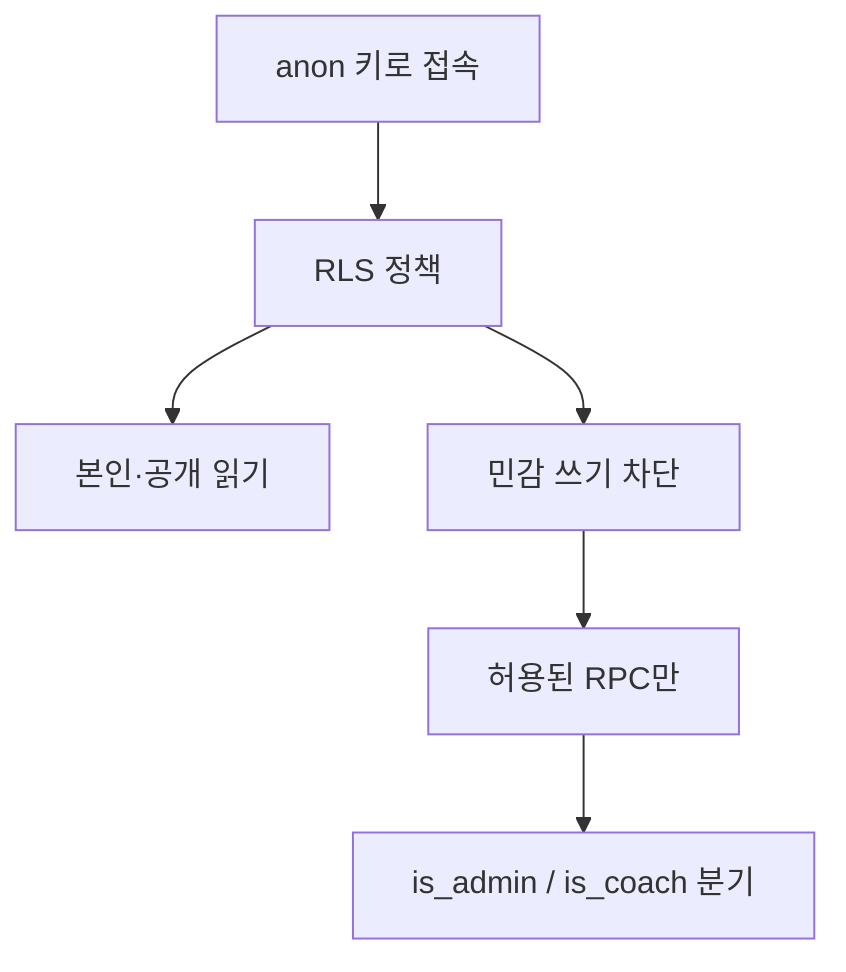

# Drop 시스템 아키텍처 · 플로우

**마지막 갱신**: 2026-07-08  
웹(Expo) · Android(EAS) · 백엔드(Supabase)가 어떻게 맞물리는지 플로우 중심으로 정리합니다.

관련 문서: [PRODUCT_SPEC.md](./PRODUCT_SPEC.md) · [PRIVACY_POLICY.md](./PRIVACY_POLICY.md) · [PUSH_AND_PLAY_STORE.md](./PUSH_AND_PLAY_STORE.md)

---

## 1. 한눈에 보는 구성



**핵심 원칙**
- 민감한 쓰기(포인트 적립, 코트 예약, 출석)는 **클라이언트가 직접 테이블을 고치지 못하고**, 서버 RPC가 지오펜스·비용·권한을 검증합니다.
- 여러 사람이 같은 화면을 보면 **Realtime**으로 코트·프로필·알림 등이 갱신됩니다.
- Supabase env가 없으면 로컬 AsyncStorage(+선택 sync 서버) 폴백입니다. **프로덕션은 Supabase**.

---

## 2. 앱 부팅 · 로그인

```mermaid
flowchart TD
  Start[앱 실행 _layout] --> Env{Supabase<br/>URL+anon?}
  Env -->|yes| InitSB[initSupabaseApp<br/>세션·프로필·Realtime 구독]
  Env -->|no| InitLocal[hydrate + 선택 sync 서버]
  InitSB --> Push{네이티브 &<br/>정회원?}
  Push -->|yes| RegToken[registerPushTokenForUser]
  Push -->|no| Ready[화면 가드]
  RegToken --> Ready
  InitLocal --> Ready
  Ready --> Guard{useAuthGuard<br/>세션?}
  Guard -->|없음| Login[/login]
  Guard -->|있음| Tabs[탭 화면]
```

### 로그인 종류

| 방식 | 동작 | 비고 |
|------|------|------|
| 학번 회원 | `drop-{학번}@example.com` + 비밀번호 | `013` 이후 신규는 **자동 승인**(준회원) |
| 게스트 | Anonymous Auth + `rpc_setup_guest_profile` | 예약·안내만, 포인트/친구 제한 |
| 관리자 | `membership_tier = admin` | `/admin` 탭, 운영 RPC |

---

## 3. 코트 예약 · 합류 (사이트 ↔ 백엔드)



**합류**: 게스트/회원이 신청 → 코트 `join_requests` → 호스트 수락 → 인원 반영 → (선택) 알림 insert → 푸시.

**경기 점수**: 입력 시 Elo·전적·포인트 즉시 반영. 하루 자동 반영 한도 초과 시 관리자 승인. 난타는 Elo 미반영.

---

## 4. 출석 · 포인트



적립은 **서버가 금액을 강제**합니다. 클라이언트가 `profiles.points`를 직접 올리지 못합니다 (`guard_profile_columns` + `006_secure_points`).

---

## 5. 레슨 · 코치 코트



코치 공지: `is_coach` 또는 admin만 작성 (`012_coach_access`).

---

## 6. 알림 · 원격 푸시



- **인앱**: 알림함·토스트·사이렌 (`notificationStore`) — 웹/앱 공통.  
- **원격 푸시**: **네이티브 앱 + 알림 허용**일 때만. 웹만으로는 OS 푸시 없음.

---

## 7. 배포 파이프라인



| 환경변수 | 용도 |
|----------|------|
| `EXPO_PUBLIC_SUPABASE_URL` | 프로젝트 URL |
| `EXPO_PUBLIC_SUPABASE_ANON_KEY` | 공개 anon 키 (RLS 적용) |
| (서버만) `service_role` | SQL 트리거·Edge — **앱/Git에 금지** |

---

## 8. 데이터·권한 계층 (요약)



마이그레이션 순서 개념: `001/complete` → `002` Storage → `005`~`015` 보안·소셜·푸시.  
상세는 [SUPABASE_MIGRATION.md](./SUPABASE_MIGRATION.md).

---

## 9. 화면 ↔ 백엔드 매핑 (빠른 참조)

| 화면 | 주요 Store | 백엔드 |
|------|------------|--------|
| `/` 코트 | `courtStore` | `rpc_reserve_court`, courts Realtime |
| `/friends` | `friendStore`, profiles | `friend_requests`, attendance |
| `/lobby` | `lobbyStore` | `team_rooms` |
| `/profile` | `authStore`, `pointStore` | check-in, points, matches |
| `/coaching` | `lessonStore`, `coachingStore` | lesson_queue, coach_announcements |
| `/admin` | admin* | RPC·로그·리셋 |
| `/privacy` | — | 정적 정책 페이지 |

이 문서는 코드가 바뀌면 함께 갱신합니다.
